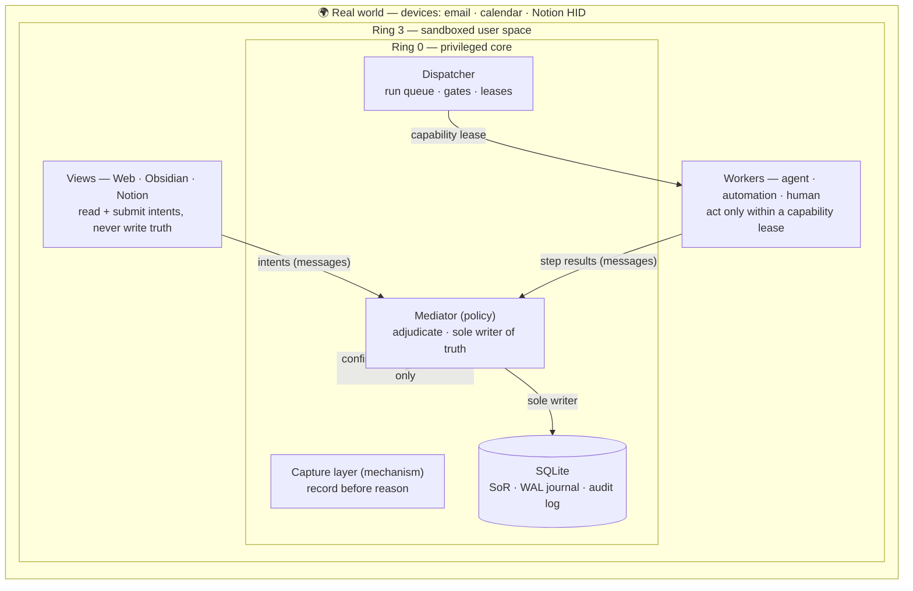
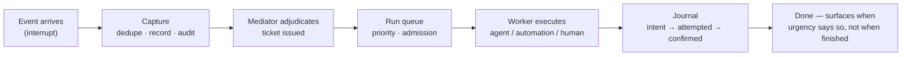

# my-day-os

An operating system for a personal day: instead of scheduling CPU and managing memory/devices, it schedules **attention** and manages calendar, email, and tasks. Work is modeled as a **deli ticket** — a future promise of completion.

Currently in the planning phase — see `AGENTS.md` for the entry point, then `Overview.md` and `docs/adr/`.

## Architecture at a glance

### The rings

Privilege is concentric, like an OS ring diagram: the innermost ring owns truth; everything outside it acts only through messages and leases.

The firewall rules are Laws (see `docs/POLICY.md`): only ring 0 writes the system of record (L1), everything is recorded before any judgment runs on it (L2), all edits travel as messages rather than shared writes (L4), and nothing irreversible happens without an explicit capability plus confirmation (L5).

### Life of a promise

Deeper dives: `docs/adr/ADR-0001` (backbone), `ADR-0002` (devices & latency), `ADR-0003` (execution & orchestration), and `docs/POLICY.md` (the kernel contract: Laws, Limits, Levers).

## AI co-authoring

This project is developed with AI assistance (Anthropic's Claude).
