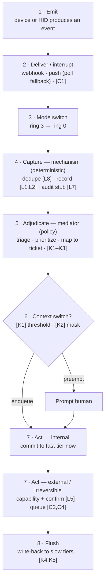
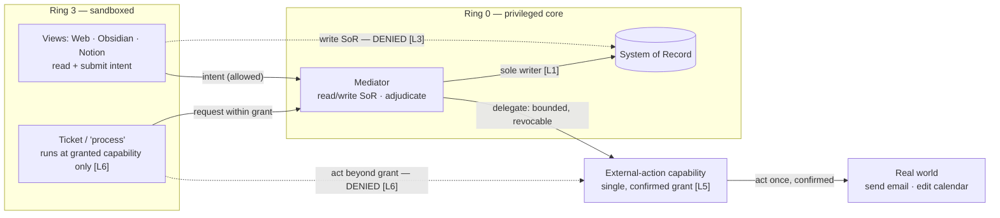
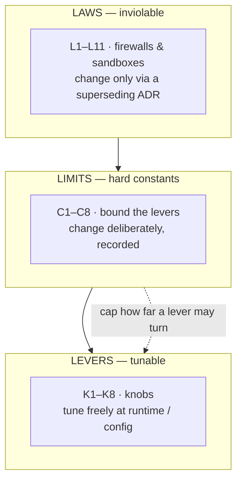

# my-day-os — Policy

**Status:** Living dictionary — co-evolves with the ADRs; not locked
**Date:** 2026-07-28
**Related:** ADR-0001 (Backbone), ADR-0002 (Device Taxonomy & Latency), ADR-0003 (Execution & Orchestration); governed by ADR-0006 (Document Architecture)

---

## What this is

The operating rules of `my-day-os` — the "kernel contract," structured as the **policy dictionary** defined in ADR-0006 §1. ADRs record *decisions*; this document is the dictionary those decisions ratify into; SPECs (when Frozen) carry the technical depth the dictionary cannot. On conflict, **this document wins over any SPEC**. It answers four questions:

1. **Protocol** — how an event is consumed, start to finish.
2. **Levers** — the knobs you may turn to change behavior.
3. **Limits** — hard constants that bound the levers.
4. **Laws** — inviolable rules that firewall/sandbox the system.

Relationship to the *mechanism-vs-policy* split (ADR-0002): this entire document **is** the policy side. Mechanism is the deterministic capture edge that runs no matter what; everything here is the decision layer that sits behind it. (The tunable tier is named **Levers**, not "policy," to avoid overloading that word.)

**Scope discipline:** we port only the OS concepts that *apply* to an attention OS — capabilities, least-privilege isolation, quotas, scheduling policy, admission control. We deliberately do **not** import virtual memory / paging, MMU address translation, DMA, or swapping. The metaphor is a toolbox, not a spec to implement line-for-line.

**Change discipline:** Laws never change without a superseding ADR. Limits change only deliberately (and are recorded). Levers may be tuned freely at config/runtime. See *Amendment process* at the end.

**Dictionary record format:** every entry reads `**ID — Name.** Statement. *(origin: ADR · SPEC: backing spec or —)*` — plus a value/default slot for Limits and Levers. Origin follows the one-origin-per-ID rule reconciled against the ADR frontmatter (`docs/adr/README.md` tracks origin-pending IDs). Prose in this file is authoritative; drift between it and frontmatter is an audit finding.

---

## 1. Laws (inviolable — the firewalls & sandboxes)

L1–L8 seeded from ADR-0001/0002; L9–L11 ratified by ADR-0003 (2026-07-28). Breaking one of these is a bug, not a tuning choice.

- **L1 — Single writer of truth.** Only the ring-0 core (the mediator, via the deterministic capture layer) writes the system of record. Nothing else, ever. *(origin: ADR-0001 · SPEC: —)*
- **L2 — Record before reason.** Every event is durably recorded *before* any non-deterministic policy runs on it. Capture cannot be skipped or reordered behind judgment. *(origin: ADR-0002 · SPEC: —)*
- **L3 — Views never mutate truth.** Ring-3 surfaces (Web, Obsidian, Notion) may read and may *submit intents*; they may never write the SoR directly. *(origin: ADR-0001 · SPEC: —)*
- **L4 — Edits are messages, not shared writes.** Human input (including Notion HID edits) enters as input events in a message-passing model — never as in-place mutation of shared state. (Resolves the cache-coherency problem.) *(origin: ADR-0002 · SPEC: —)*
- **L5 — No unprivileged irreversible action.** No irreversible real-world action (send email, decline invite, delete) occurs without an explicit, granted capability **and** confirmation. A hallucination cannot act in your name. *(origin: ADR-0002 · SPEC: —)*
- **L6 — Least privilege by default.** Every process/agent/view runs with the narrowest capability set that lets it do its job. Absence of a grant means denial. *(origin: ADR-0002 · SPEC: —)*
- **L7 — Auditability is mandatory.** Every mediator decision logs raw event + decision + rationale. A non-replayable decision is not allowed. *(origin: ADR-0002 · SPEC: —)*
- **L8 — Idempotent capture.** The same event delivered twice (expiring channels + polling fallback) is recorded once. Dedupe is not optional. *(origin: ADR-0002 · SPEC: —)*
- **L9 — Write-ahead before act.** No external action occurs without a prior durable journal entry. Workers never write the journal (or any part of the SoR) directly: step intents and results are submitted as messages, and the ring-0 core performs every durable write. Enables safe, non-duplicating resume. *(origin: ADR-0003 · SPEC: —)*
- **L10 — Idempotent execution.** The system never *knowingly* risks a duplicate external effect. (Exactly-once is physically impossible — two-generals; this Law governs behavior.) Upheld by the per-device confirmation ladder (ADR-0003): native idempotency key where supported, confirmation write-back where observable, escalation to WaitingHuman where opaque. Blindly re-acting an unconfirmed irreversible step is a violation. Mirror of L8 for outputs. *(origin: ADR-0003 · SPEC: —)*
- **L11 — Leased authority.** A worker acts only within a bounded, time-limited, revocable capability lease granted for its ticket — the execution-time extension of L6. Irreversible actions still require confirmation (L5) even within a lease. *(origin: ADR-0003 · SPEC: —)*

---

## 2. Limits (hard constants — bound the levers)

*Stubbed — values to be ratified by ADRs. These cap how far a lever may be turned before it endangers the system.*

- **C1 — Min external poll interval / rate ceiling.** Respect device "bus bandwidth" (e.g. Notion ~3 req/s). *(value: TBD · origin: ADR-0002 · SPEC: —)*
- **C2 — Max in-flight writes / flush queue depth.** Backpressure before the fast tier outruns slow tiers. *(value: TBD · origin: ADR-0004 · SPEC: —)*
- **C3 — Absolute WIP cap on active tickets.** A ceiling on concurrently "running" promises, independent of any lever. *(value: TBD · origin: pending — claim proposed by ADR-0005 · SPEC: —)*
- **C4 — Max unconfirmed-action queue age.** Irreversible actions awaiting confirmation expire rather than pile up. *(value: TBD · origin: ADR-0004 · SPEC: —)*
- **C5 — Max concurrent workers.** Hard ceiling on dispatcher concurrency; the tunable level K6 turns only below it — the dispatcher enforces min(K6, C5). *(value: TBD · origin: ADR-0003 · SPEC: —)*
- **C6 — Per-worker budget.** Max tokens / cost / wall-time per ticket execution; wall-time expressed in scheduler ticks (quantum value: SPEC-level). *(value: TBD · origin: ADR-0003 · SPEC: —)*
- **C7 — Max retry attempts.** Beyond the cap a ticket enters Compensating, then Dropped. *(value: TBD · origin: ADR-0003 · SPEC: —)*
- **C8 — Scheduler tick quantum.** The single atomic time unit: every internal timeout (dispatch-ack, wall-time in the per-worker budget (C6), confirmation timeouts, lease durations, backoff pacing) is expressed in ticks, derived on demand from the host monotonic clock (tickless). Violation: an internal timeout expressed in any other unit. *(value: TBD — human-scale, likely ≥ 1 s · origin: ADR-0004 · SPEC: —)*

---

## 3. Levers (tunable knobs — safe to turn)

*K1–K3 claim proposed by ADR-0005 (in review); K4–K5 ratified by ADR-0004 (2026-07-29); K6–K8 ratified by ADR-0003. All defaults TBD.*

- **K1 — Context-switch threshold.** How important an event must be to preempt current focus. *(default: TBD · origin: pending → ADR-0005 expected · SPEC: —)*
- **K2 — Masking / quiet-hours windows.** Time windows where interrupts are recorded but never preempt. *(default: TBD · origin: pending → ADR-0005 expected · SPEC: —)*
- **K3 — Triage aggressiveness.** How eagerly the mediator promotes events into tickets. *(default: TBD · origin: pending → ADR-0005 expected · SPEC: —)*
- **K4 — Flush cadence.** How often the write-back cache flushes to Notion/external. *(default: TBD · origin: ADR-0004 · SPEC: —)*
- **K5 — Batch size.** Events/writes grouped per external call (paired with C1). *(default: TBD · origin: ADR-0004 · SPEC: —)*
- **K6 — Worker concurrency level.** How many workers the dispatcher runs at once; capped by C5. *(default: TBD · origin: ADR-0003 · SPEC: —)*
- **K7 — Retry / backoff policy.** Backoff shape and pacing for failed steps; attempt count capped by C7. *(default: TBD · origin: ADR-0003 · SPEC: —)*
- **K8 — Executor-kind routing bias.** How eagerly the mediator prefers automation over an agent when assigning `executor_kind`. *(default: TBD · origin: ADR-0003 · SPEC: —)*

---

## 4. Protocol (how an event is consumed)

The lifecycle contract, from ADR-0002's event model. Each step names the tier that governs it.

1. **Emit** — a device (email, calendar) or the HID (Notion) produces an event.
2. **Deliver (interrupt)** — arrives via webhook/push; polling is the fallback line. *[respects C1]*
3. **Mode switch** — cross ring 3 → ring 0 into the privileged core.
4. **Capture (mechanism, deterministic)** — dedupe *[L8]*, then durably record *[L1, L2]*, then write the audit stub *[L7]*.
5. **Adjudicate (policy, mediator)** — triage, prioritize, map to ticket mutations. *[levers K1–K3]*
6. **Context-switch decision** — preempt the human, or enqueue silently. *[lever K1, mask K2]*
7. **Act** — internal ticket mutations commit to the fast tier immediately; external/irreversible actions require capability + confirmation *[L5]* and are queued for write-back *[K4, K5, C2, C4]*.
8. **Flush** — the fast tier reconciles to slow tiers asynchronously ("pending" until flushed).

### Capability & sandbox model (the firewall in practice)

| Principal | May do | May **not** do |
|---|---|---|
| Mediator (ring 0) | Read/write SoR; adjudicate; request external actions | Take irreversible external action without confirmation *[L5]* |
| Views — Web/Obsidian/Notion (ring 3) | Read SoR; submit intents | Write SoR *[L3]* |
| A ticket / "process" | Only what its granted capability allows | Anything outside its grant *[L6]* |
| Worker — agent / automation / human (ADR-0003) | Act within its capability lease; submit step intents & results as messages | Write the SoR or journal directly *[L1, L9]*; act beyond or after its lease *[L11]* |
| External-action capability | The specific granted action, once confirmed | Persist or escalate beyond the single grant |

---

## 5. Diagrams

Standalone sources live in `docs/diagrams/` (rendered together in `docs/diagrams/my-day-os-diagrams.html`).

### Event-consumption protocol (§4), with governing tiers

### Capability & sandbox model (the firewall)

### Tier structure & change discipline

---

## Amendment process

Governed by ADR-0006 §3 (authoritative). In brief:

- **Laws** — change only by a superseding ADR that explicitly names the law being altered. Never edited silently. A ratified Law change is a breaking change (`docs(policy)!:`).
- **Limits** — change deliberately; record the old→new value and the reason here.
- **Levers** — tune freely in config/runtime; no ADR required. Defaults live here once their owning ADRs land.

---

*Living document. Laws L1–L11 are stable. Limits C1–C8 and Levers K1–K9 all have origins ratified or in review (ADR-0005); values and defaults remain TBD pending the SPEC layer.*
