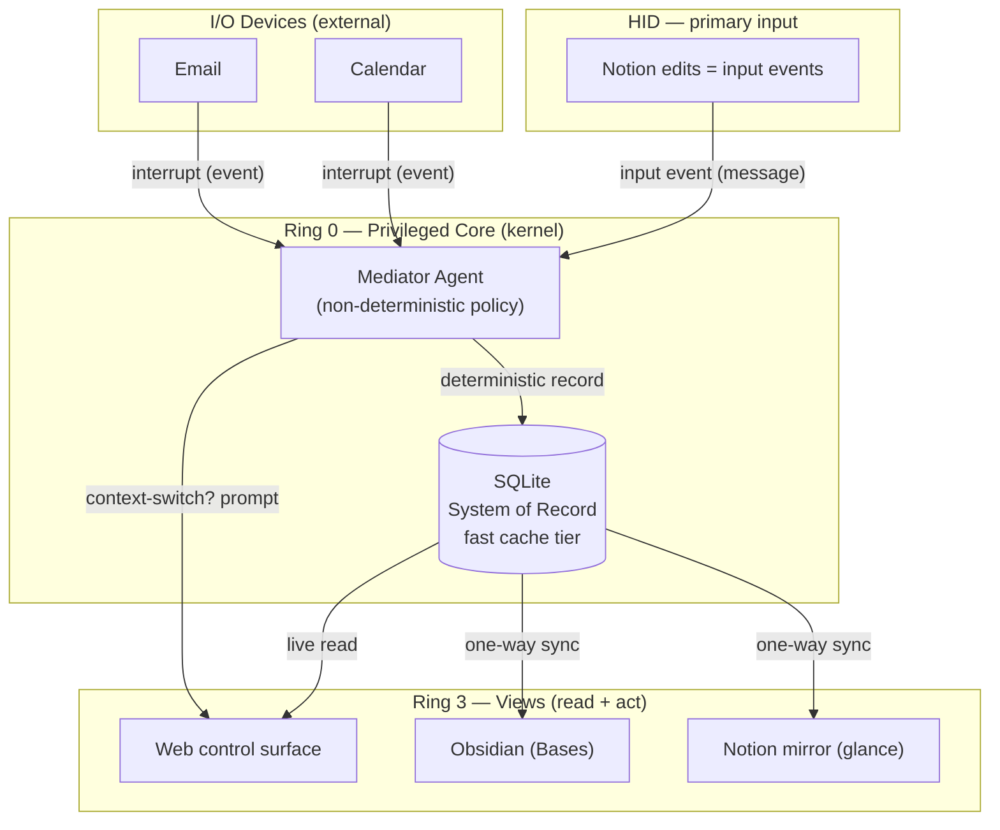
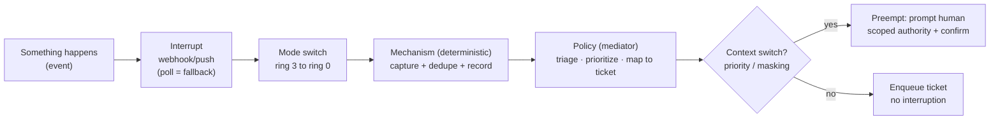
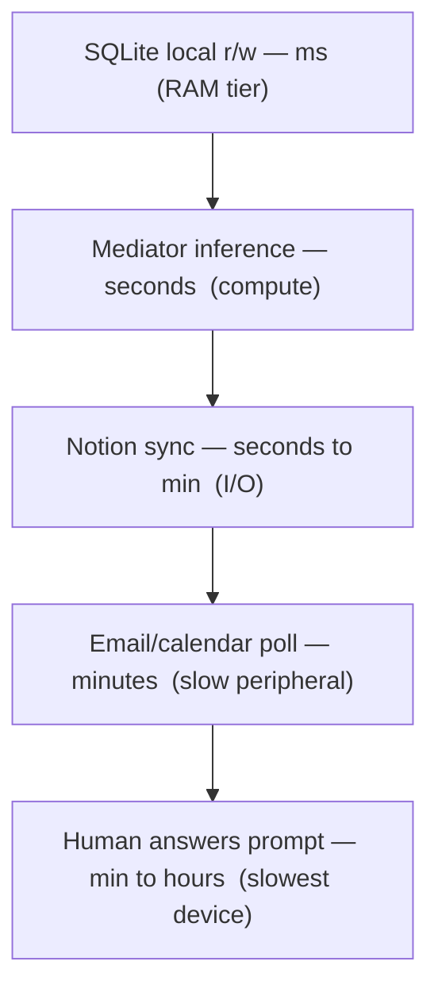

# ADR-0002: Device Taxonomy & Latency Hierarchy

**Status:** Accepted (2026-07-28 — backfill review per ADR-0006 action item 6)
**Date:** 2026-07-26
**Deciders:** Carlos
**Related:** Builds on ADR-0001 (Backbone)

---

## Context

ADR-0001 chose the backbone (SQLite as the system of record, Notion repositioned to a view). In working through it, two structural ideas emerged that deserve to be first-class decisions, because they govern how every other component is classified and how the system copes with delay.

1. **Everything is a device with an OS role.** Rather than ad-hoc labels ("integration", "sync target"), each part of `my-day-os` maps to a specific class of OS device. The most consequential reclassification: **Notion is the keyboard & mouse — the primary Human Interface Device (HID)** — not a database and not the backbone.
2. **Delay is not a defect; it is the OS latency hierarchy, scaled up.** A real OS spans ~9 orders of magnitude of latency (register → RAM → disk → network → human) and its entire job is managing that spread. `my-day-os` has the same hierarchy with the constants multiplied into human-perceptible time. The techniques a kernel uses to hide latency transfer directly.

These two ideas collide productively — and the collision points at the right concurrency model. That is the substance of this ADR.

---

## Decision

Adopt an explicit **OS device taxonomy** for every component, and treat **system delay as a managed latency hierarchy** rather than a set of bugs to eliminate. Concretely:

- Classify Notion as the **primary HID**. A Notion edit is an **input event (a message)**, never a direct write to the system of record.
- Classify email and calendar as **external I/O devices** (data sources), never backbone candidates.
- Keep the **mediator agent** as the ring-0 privileged handler that adjudicates all events, under a strict **mechanism-vs-policy** split.
- Design around the latency hierarchy using standard kernel techniques (local cache tier, write-back, batching, non-blocking I/O). Treat eventual consistency as **an unflushed write-back cache**, not an error.
- Resolve the resulting cache-coherency problem with **message-passing, not shared memory**: human edits arrive as events, they do not mutate shared truth in place.

Reviewed and **Accepted** 2026-07-28 — see *Review Notes* below. The model was already load-bearing: ADR-0003 was built on it and accepted first.

---

## The Device Taxonomy

| Component | OS device class | Role | Owns truth? |
|---|---|---|---|
| SQLite (local, single file) | RAM + process table (fast tier) | Authoritative ticket store / cache | **Yes — the only writer of truth** |
| Mediator agent | Kernel, ring 0 — privileged handler | Adjudicates events, issues/adjusts tickets | Acts on the store; does not *hold* truth |
| Notion | **Keyboard & mouse (HID)** | Primary human input surface | **No** — emits input events |
| Web control surface | Terminal (I/O) | Act + answer mediator prompts in real time | No — submits intents |
| Obsidian (Bases) | Monitor (read) + future notes disk | Owned, local read mirror; notes/knowledge home | No — read mirror |
| Email, Calendar | Disk / network I/O devices | Emit external events | No — external sources |

**Confirmation class (additive delta from accepted ADR-0003).** Each device additionally declares a *confirmation class* ∈ {`idempotent-keyed`, `confirmable`, `opaque`} — it selects the rung of the L10 confirmation ladder used when acting on that device. Per-device classifications are driver/SPEC detail, not fixed here.

### Why Notion = HID (and why it matters)

A keyboard does not *store* state; it *emits keystrokes*. Reclassifying Notion from "store" to "input device" dissolves the second-source-of-truth trap flagged in ADR-0001: when you edit a ticket in Notion you are **not mutating truth**, you are generating an **input event** that the mediator adjudicates before anything commits. The Notion API's job becomes a **device driver** — reading the input device — and its rate limits/latency matter far less for input than they would for authority.

The recursion is real, not a pun: your physical keyboard/mouse → your OS → **Notion (a virtual HID)** → the `my-day-os` kernel. This is a nested / virtualized input stack, and it is coherent.

### The mediator, mechanism vs policy

The privileged ring is occupied by a **non-deterministic agent**, fenced by deterministic edges:

- **Mechanism (deterministic, dumb, always runs):** capture the event, dedupe it, record it durably. No AI decides *whether* to persist a fact.
- **Policy (non-deterministic, the mediator):** triage, prioritize, translate the event into ticket mutations, and decide whether it earns a **context switch** (preempting the human's focus).

Three guardrails make a non-deterministic privileged principal safe:

- **Auditability** — the deterministic layer logs raw event + decision + rationale, so runs are replayable. Determinism at the edges makes the fuzzy middle trustworthy.
- **Scoped authority** — the mediator freely mutates internal tickets, but irreversible real-world actions (send email, decline invite) require confirmation or a narrower capability. Prevents a confused deputy acting on a hallucination.
- **Idempotency** — because events arrive over expiring channels with polling as fallback, the capture layer dedupes so one event is not adjudicated into two tickets.

---

## The Latency Hierarchy

A real OS is a machine for managing latency across a hierarchy. `my-day-os` is the same picture, scaled ~10⁹ into human time:

| Real OS tier | Latency | my-day-os equivalent | Latency |
|---|---|---|---|
| Register / RAM | ns | SQLite local read/write | ms |
| Compute (slow ALU) | ns–µs | Mediator agent inference | seconds |
| Disk / network I/O | µs–ms | Notion sync | seconds–min |
| Slow peripheral | ms | Email / calendar polling | minutes |
| — | — | Human answering a prompt | min–hours |

**Consequence:** delay is the *organizing principle*, not a bug. The kernel latency toolkit transfers directly:

- **Cache tier** — SQLite is the fast local cache in front of slow Notion/email. The scheduler reads/writes the cache, never the slow device.
- **Write-back over write-through** — commit to the fast tier immediately; flush to Notion/external actions asynchronously. **Eventual consistency = a write-back cache that has not flushed yet.**
- **Batching to bus bandwidth** — Notion's ~3 req/sec is a bus limit; batch and back off against it.
- **Non-blocking I/O** — the scheduler must never block on a slow device; the human is the slowest device on the bus.

### The collision: cache coherency → message passing

Making Notion an **input device** (that the human can write to) turns it into a second writer against the "cache" — a classic **cache-coherency / multiprocessor** problem: two CPUs writing shared memory. The clean resolution is the one the HID reframe already implies: **do not model human edits as shared-memory writes** needing a coherency protocol. Model them as **messages** (input events) in a **message-passing** system. Message-passing over shared memory is the saner concurrency choice here, and the HID reframe delivers it for free.

---

## Diagrams

### 1. Layered / ring architecture

### 2. Event lifecycle (interrupt → context switch)

### 3. Latency hierarchy

---

## Consequences

**Easier:** every component now has a precise OS role, so responsibilities and write-authority are unambiguous; the latency model turns "delay" from a problem into a set of well-understood engineering techniques; message-passing sidesteps distributed-coherency pain.

**Harder:** the mediator's policy layer must be built with audit logging, scoped capabilities, and dedupe from day one — these are not optional add-ons. The write-back model means the fast tier and Notion/external state are *intentionally* divergent for windows of time, which must be communicated in any view ("pending flush").

**Revisit:** the exact masking/priority policy that decides context switches (ADR-0005); the email/calendar **provider interface** — per the ADR-0001 backfill review, no provider is picked: a generic interface is defined and implemented per provider (Google, Outlook, …) as interchangeable drivers, no lock-in.

---

## Review Notes (backfill, per ADR-0006 §4)

**Reviewed:** 2026-07-28 · **Verdict:** Accepted with amendments (applied) · **Reviewer:** Carlos stamped; review conducted by Claude per the ADR-0006 §4 checklist.

- **No formal policy-delta table** (pre-dates the ADR-0006 required shape): this ADR's guardrails are the seeds POLICY.md credits for L1–L8, plus C1 and the K4/K5 concepts. POLICY.md is the authoritative formalization; the W3 frontmatter will record the mapping. No conflicts with L1–L11 found — ADR-0003 was built on this model and accepted first.
- **Amendments applied:** confirmation-class field added to the taxonomy (fulfilling ADR-0003 action item 6); Revisit line aligned with the generic provider-interface decision from the ADR-0001 backfill review; action items 2–4 re-scoped below.
- **Alternatives:** no formal Options section, but the cache-coherency section genuinely weighs shared-memory-plus-coherency against message-passing — substantively satisfied.
- HID interaction model clarified during review: Notion is a *touchscreen* (display + input on one surface); user edits are keystrokes adjudicated into tickets, never writes. Echo suppression and the flush-policy triad (dirty tracking / force flush / anti-entropy scrub) recorded against the re-scoped items below.

## Action Items (research/planning — no code yet)

1. [x] Sign off on the device taxonomy and the message-passing (not shared-memory) stance. *(Signed off 2026-07-28, backfill review.)*
2. [ ] Define the **input-event schema**. *(Re-scoped 2026-07-28 to SPEC-level work; must include HID echo suppression — capture diffs against the expected post-flush state so the OS never re-ingests its own writes as user input.)*
3. [ ] Define the **audit-log record**. *(Re-scoped 2026-07-28 to SPEC-level work, alongside the journal-record schema of ADR-0003 action item 4.)*
4. [ ] Specify the **write-back flush policy**. *(Re-scoped 2026-07-28 to K4/K5 defaults — likely ADR-0004 territory — incorporating the flush triad: dirty tracking, explicit force flush, anti-entropy scrub; see BACKLOG.)*
5. [ ] Draft the masking/priority policy for context switches (now ADR-0005 — queued as W10; ADR-0003 became execution & orchestration).
