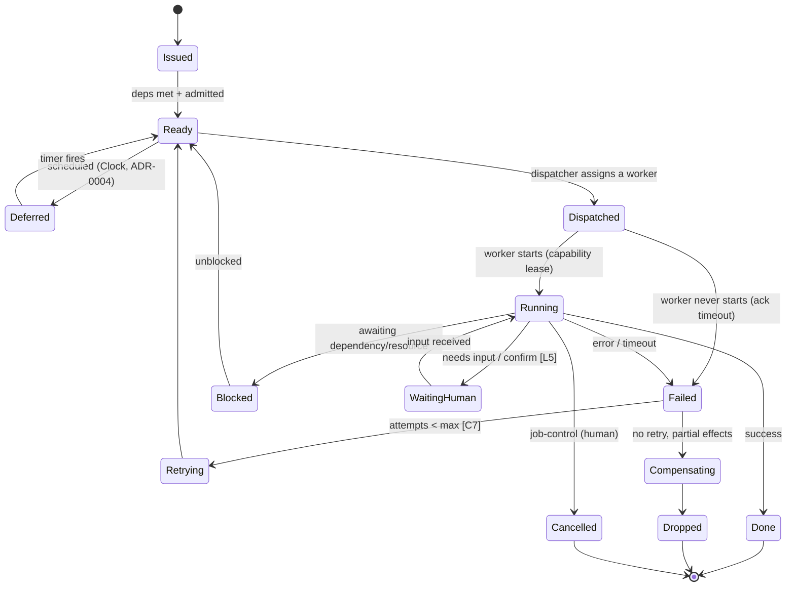
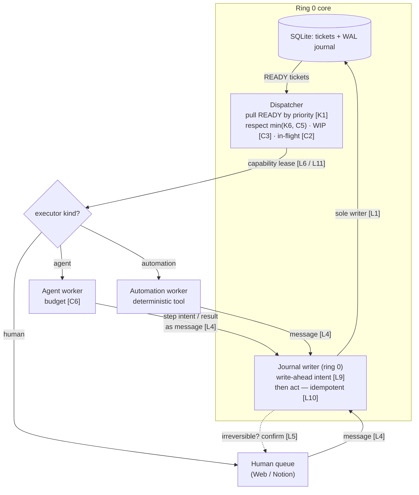

# ADR-0003: Execution & Orchestration Model

**Status:** Proposed
**Date:** 2026-07-27
**Deciders:** Carlos
**Related:** Builds on ADR-0001 (Backbone), ADR-0002 (Device Taxonomy & Latency); ratifies deltas into POLICY.md

---

## Context

ADR-0001 and ADR-0002 designed the *front of house*: how events arrive, get adjudicated by the mediator, and become tickets in the SQLite system of record. The agentic-orchestration review (Overview §2) found the *back of house* missing: nothing **executes** a promise. Today `my-day-os` can take a ticket and prioritize it, but it has no worker, no run queue, no failure handling, and no way to resume interrupted work.

This ADR designs that execution layer. It must respect everything already decided — the mediator as sole writer (L1), message-passing (L4), least privilege (L6), confirmation for irreversible actions (L5), and the latency hierarchy — and it must not drift into porting OS concepts that don't apply. The pivotal choice, from which everything else follows, is **what a "worker" is**: the thing that fulfills a ticket.

Constraints from the charter still hold: single user, minimal code, single-responsibility, Python 3.12, portable, planning before code.

---

## Decision

**Proposed:** Adopt a **polymorphic Worker** model driven by a single **Dispatcher**. A ticket declares its *executor kind* — **agent**, **automation**, or **human** — and the dispatcher pulls READY tickets from a priority-ordered run queue (subject to concurrency and budget limits), leases the worker a bounded capability, and runs the work as **durable, resumable, idempotent steps** journaled to a write-ahead log. Partial failures are handled by retry-with-backoff or explicit **compensation**.

In deli terms: the shop has line cooks (agents), machines (automations), and you (human). A promise is routed to whoever can fulfill it; the ticket rail (run queue) and the expo (dispatcher) stay the same regardless.

Status is **Proposed** — this is the design for your review, not an implementation.

---

## Options Considered — the Worker abstraction

### Option A: Agent-only
Every ticket is fulfilled by a spawned LLM sub-agent.

| Dimension | Assessment |
|---|---|
| Flexibility | High — handles any judgment task |
| Cost / latency | **Poor** — tokens + seconds even for trivial mechanical work |
| Determinism | **Poor** — non-deterministic even where determinism is available and preferable |

**Pros:** one uniform executor; maximal capability. **Cons:** overkill and expensive for "move a calendar event 30 min"; injects non-determinism where a script would be exact and free. Fights the latency/cost budget.

### Option B: Automation-only (deterministic tools/scripts)
Every ticket is fulfilled by a deterministic tool.

**Pros:** cheap, reliable, testable, fast. **Cons:** can't handle judgment, triage, or anything fuzzy — which defeats the "AI-backed OS" premise. Most interesting promises need a mind.

### Option C: Human-only (system tracks, you execute)
The OS never does work; it only records and reminds.

**Pros:** trivial, zero risk. **Cons:** it's a task tracker, not an operating system that *does* things. Abandons the entire orchestration goal.

### Option D: Polymorphic Worker (recommended)
A ticket carries an `executor_kind ∈ {agent, automation, human}`; the dispatcher routes accordingly through one uniform Worker interface.

| Dimension | Assessment |
|---|---|
| Flexibility | High — each kind used where it fits |
| Cost / latency | **Good** — deterministic work stays cheap; agents reserved for judgment |
| Determinism | **Good** — mechanical tickets are exact; only fuzzy ones are non-deterministic |
| Complexity | Medium — one routing decision + one interface with three backends |

**Pros:** matches reality; keeps SRP (each executor kind does one thing); lets the latency/budget model actually work (don't spend an agent on a script's job). **Cons:** adds a routing decision — "who executes this ticket?" — which is itself a small mediator policy call, and one interface with three implementations to maintain.

---

## Trade-off Analysis

A and B each optimize one axis (capability vs. cost/determinism) and lose the other; C abandons the goal. D is the only option that lets the **latency hierarchy and per-worker budgets** from ADR-0002 do their job — you cannot "reserve agents for judgment and keep mechanical work cheap" unless mechanical work has a non-agent executor. The cost of D is a routing decision and a slightly larger interface, both modest. The routing decision is a natural extension of what the mediator already does (it adjudicates events into tickets; assigning an executor kind is one more field on that adjudication).

One honesty note: **compensation is not true rollback.** Real-world actions (a sent email) can't be un-done; "compensation" means issuing a *corrective* follow-up action, not reversing history. The model must treat compensation as best-effort mitigation, and lean on L5 (confirm irreversible actions) to avoid needing it.

---

## Execution Model (what follows from Option D)

### Ticket execution state machine

Human job-control may cancel a ticket from **any non-terminal state** (Issued, Ready, Deferred, Dispatched, Blocked, WaitingHuman, Running); only the Running edge is drawn to keep the diagram legible.

### Dispatcher & run queue

A single dispatcher (simplicity over a multi-scheduler design) pulls READY tickets ordered by priority (Lever K1), subject to worker concurrency — the dispatcher enforces **min(K6, C5)**: K6 is the tunable level, C5 the hard ceiling, matching the K5/C1 pairing — and the WIP cap (Limit C3) and in-flight ceiling (Limit C2). **Admission control:** a ticket becomes READY only when its dependencies are satisfied *and* a budget is available — this is how runaway load is refused at the door rather than mid-flight.

### Failure semantics

Timeouts bound every worker (a hung agent is the slowest device on the bus). Two distinct bounds: a short **dispatch-acknowledge timeout** (a worker must move Dispatched → Running or the ticket fails and re-enters the retry path) and the **execution wall-time budget** (part of C6, bounding a running worker). Both are expressed in a single scheduler time unit — the tick/quantum — whose value is a SPEC-level constant, so all timeouts share one atomic unit rather than each inventing its own clock. Failures retry with capped exponential backoff (new Lever: retry policy; new Limit: max attempts). Beyond the cap, a ticket enters **Compensating** (best-effort corrective action) then **Dropped**. Idempotency keys make a retried step safe to re-run.

### Exactly-once and the confirmation ladder

Exactly-once external effect is physically impossible (the two-generals problem): a crash between *acting* and *journaling the result* is indistinguishable, on restart, from a crash before acting — intent present, result absent, and the journal alone cannot say whether the email went out. L10 therefore governs **behavior, not physics**: the system never *knowingly* risks a duplicate external effect. It upholds that through a three-rung ladder, selected per device:

1. **Native idempotency key** — the device deduplicates (e.g. Stripe-style keys): retry with the same key is safe; true at-most-once.
2. **Confirmation write-back** — the device signals or is queryable. An external step journals three marks: **intent** (before acting, L9) → **attempted** (act call issued) → **effect-confirmed**. The confirmation is *not* a special channel: it arrives as an ordinary inbound device event (webhook, poll observation, probe for an embedded marker) through the standard capture path — deduped [L8], written by ring 0 [L1] — and is correlated to the pending journal entry by its idempotency key/marker. On restart, the only suspect set is `attempted`-without-`effect-confirmed`; the rule is **solicit the signal, never re-act while unconfirmed**. This mirrors the write-back model already in the protocol (step 8: "pending until flushed" — here, *pending until confirmed*).
3. **Opaque device** — no key, no signal: any ambiguity escalates the ticket to **WaitingHuman**. For irreversible actions the bias is explicit: a possible no-send beats a possible double-send.

Rung selection is a **per-device property, not per-ticket logic**: this ADR proposes a small additive delta to the ADR-0002 device taxonomy — each device declares a *confirmation class* ∈ {`idempotent-keyed`, `confirmable`, `opaque`} — and the journal semantics of a step follow from the class of the device acted on. The confirmation timeout (in ticks), the journal step schema, and marker formats are SPEC-level constants.

### Durable, resumable journal (write-ahead log)

Distinct from the audit log (L7 records *decisions & rationale*); the journal records *execution steps* so work **resumes rather than restarts** after a crash — critical because the runtime host may be ephemeral. The rule: **write the intent to the durable journal before acting**, so on restart the dispatcher reads the last durable state per in-flight ticket and continues without double-acting. Both logs can live in the same SQLite file.

**Who writes the journal — L1/L4 preserved.** Workers never write the journal (or any part of the SoR file) directly. A worker *submits* step intents and results as messages; the ring-0 core performs every durable write, journal included. This keeps L1 absolute — one writer of truth, no exceptions for execution — and it strengthens the crash story: one writer means exactly one recovery path to reason about on restart.

### Capability leases (the sandbox around a running worker)

The mediator delegates to each worker a **bounded, time-limited, revocable** capability lease — only what its ticket needs, expiring when the ticket ends (extends L6). Irreversible actions still require confirmation (L5) even with a lease. A spawned agent physically cannot act outside its lease.

### Concurrency & shared resources

Tickets may declare **dependencies** (a small DAG: ticket A blocks B) and **required resource leases** (e.g. `calendar-write`). The dispatcher serializes access to a shared external resource via a single-writer lease so two workers never clobber the calendar. Deadlock is avoided by acquiring leases in a canonical order (or one-writer-per-resource).

### Observability & job control

The Web control surface (ADR-0001) must expose a live **job view** — running / blocked / failed / waiting tickets — and support job-control actions: pause, cancel, retry, force a context switch. This is the OS's `top`/`ps` plus job control, and it is where the human intervenes in agent work.

---

## Proposed POLICY deltas (ratify into POLICY.md on acceptance)

*Listed here, not yet written to POLICY.md — the amendment process says only an accepted ADR ratifies Laws/Limits.*

**New Laws (proposed):**
- **L9 — Write-ahead before act.** No external action occurs without a prior durable journal entry (enables safe, non-duplicating resume).
- **L10 — Idempotent execution.** The system never *knowingly* risks a duplicate external effect. (Exactly-once is physically impossible — two-generals; the Law governs behavior.) Upheld by the per-device confirmation ladder (§Exactly-once and the confirmation ladder): native idempotency key where supported, confirmation write-back where observable, and escalation to WaitingHuman where opaque. Blindly re-acting an unconfirmed irreversible step is a violation.
- **L11 — Leased authority.** A worker acts only within a bounded, revocable capability lease (execution-time extension of L6).

**New Limits (proposed):**
- **C5 — Max concurrent workers** (dispatcher concurrency; pairs with C2/C3).
- **C6 — Per-worker budget:** max tokens / cost / wall-time per ticket execution.
- **C7 — Max retry attempts.**

**New Levers (proposed):**
- **K6 — Worker concurrency level.**
- **K7 — Retry / backoff policy.**
- **K8 — Executor-kind routing bias** (how eagerly the mediator prefers automation over an agent).

---

## Consequences

**Easier:** work actually gets done, by the cheapest capable executor; the latency/budget model from ADR-0002 becomes operational; crash recovery is well-defined; a running system is inspectable and interruptible.

**Harder:** three executor backends and a routing decision to build and test; the journal + idempotency discipline must be in place *before* any external action is automated (not bolted on later); compensation logic is inherently best-effort and must be scoped honestly.

**Revisit:** the routing policy (how the mediator picks executor kind) as usage teaches which tickets suit automation; whether one dispatcher stays sufficient.

---

## Deferred to follow-up ADRs

- **ADR-0004 — Timer / Clock device:** time-triggered and recurring promises. Referenced by the `Ready → Deferred → Ready` transition above; a day OS is mostly time-triggered, so this is the natural next decision after execution.
- **ADR-0005 — Masking & priority policy:** ratifies context-switch Levers K1–K3 and the attention-preemption rules.

---

## Action Items (research/planning — no code yet)

1. [ ] Sign off on the polymorphic Worker (Option D) and the executor-kind field on a ticket.
2. [ ] Ratify the proposed POLICY deltas (L9–L11, C5–C7, K6–K8) into POLICY.md, or amend.
3. [ ] Finalize the execution state machine (confirm states/transitions above).
4. [ ] Specify the **journal record** schema (step, intent, idempotency key, result) — distinct from the audit record.
5. [ ] Define the **routing rule**: how the mediator assigns `executor_kind` when it issues a ticket.
6. [ ] Record the **confirmation class** field (`idempotent-keyed` / `confirmable` / `opaque`) as an additive delta to the ADR-0002 device taxonomy.
7. [ ] Then, and only then, scope the *first* single-responsibility component (likely: the ticket + state-machine schema, or the dispatcher skeleton).
