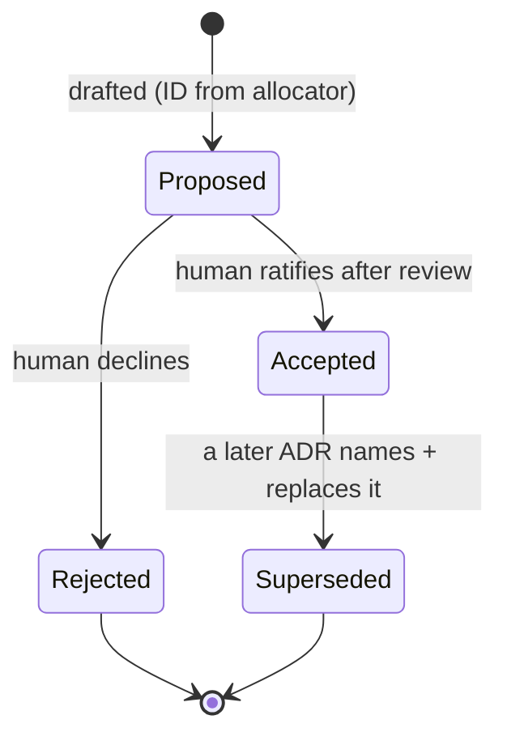

# ADR-0006: Document Architecture & Governance Process (meta-ADR)

**Status:** Accepted (2026-07-28)
**Date:** 2026-07-28
**Deciders:** Carlos
**Related:** Governs the process around all ADRs; codifies conventions practiced informally in ADR-0001..0003, POLICY.md, and the W1 review. ADR-0004/0005 reserved for Timer/Clock and Masking & priority (see ADR-0003 §Deferred).

---

## Context

The repo grew a three-tier document system organically: ADRs as RFC-like proposals, POLICY.md as the living kernel contract, and (planned) SPECs as frozen formal snapshots. The W1 review of ADR-0003 exercised this machine end-to-end — checklist review, amendment, acceptance, ratification into POLICY.md — and it worked, but every rule it followed lives only in conversation history. A solo-dev project whose main currency is **attention** cannot afford process that must be re-derived from memory; the process itself must be a document with an ID.

This ADR is the meta-ADR: it writes down the document architecture, the ADR lifecycle, the amendment story, the ratify/audit doctrine, and the attention-protection limits. It governs *how decisions are made and recorded* — not the runtime system (that remains POLICY.md's domain).

## Motivation

Without this ADR: lifecycle states are folklore ("Proposed" means whatever we remember it meaning), amendments have no defined path, nothing bounds how many open proposals can compete for the single reviewer's attention, and automation (`just ratify`, `just audit`) has no charter to be built against. Each of these was hit in practice during W1 — the review had to *invent* its own finish line (GAPS#W1) because none existed. With this ADR: every rule the W1 review improvised becomes canon, and future reviews are procedure, not archaeology.

---

## Decision

Adopt the three-tier document architecture and governance process below. Reviewed and **Accepted** 2026-07-28 — all rules are now in effect; tooling (`just ratify`, `just audit`, frontmatter) is chartered here and built as separate work items (W3, W6, W7). See *Review Notes* below.

---

## 1. Document taxonomy & authority

| Document | Role | Mutability |
| --- | --- | --- |
| **ADR** (`docs/adr/`) | RFC/PEP-like proposal: context, options, decision, proposed policy deltas | Immutable in substance once Accepted (see §3) |
| **POLICY.md** | The dictionary of ratified policies — Laws (L), Limits (C), Levers (K); the kernel contract | Living; changes only via ratification or the amendment rules it declares |
| **SPEC** (`docs/spec/`) | Frozen formal snapshot: only what POLICY *cannot* capture — strict technical definitions that back POLICY's ability to govern | Draft mutable; a Frozen version is immutable — changes bump the semver |
| **BACKLOG / TODO / GAPS** | The work system: intent (someday / queued / depth) | Freely mutable; never authoritative over canon |

**Authority rules:**

- On conflict between POLICY.md and a SPEC, **POLICY wins**; the SPEC is defective and must be corrected.
- TODO/GAPS record **intent** (what was chosen and queued); audit output records **state** (what canon says is unresolved). Neither overrides the other; disagreements are findings, not verdicts.
- Canon lives in `docs/` in this repository until a **second consumer** exists; only then is extraction (submodule/separate repo) reconsidered.

## 2. ADR lifecycle

- **Proposed** — open for review and freely editable; the design conversation happens here.
- **Opening a review** means conducting the review checklist (§4) against the ADR. **Closing** means the human records a verdict.
- **Accepted** — the verdict is stamped by the human (never by automation — §5) and recorded *in the ADR itself* as a **Review Notes** section (findings + resolutions), so the outcome never has to be re-derived. Acceptance triggers ratification of the ADR's proposed policy deltas into POLICY.md.
- **Rejected** — recorded with a short reason; the ID is burned (never reused).
- **Superseded** — an Accepted ADR is replaced only by a later Accepted ADR that **names it explicitly**. Deltas are re-ratified accordingly.

## 3. Amendment rules

- An **Accepted ADR is immutable in substance.** Changing a decision requires a new, superseding ADR — never an edit. (Precedent: the W1 amendments to ADR-0003 were legal because its status was still Proposed.)
- **Editorial fixes** (typos, broken links, stale cross-references that misstate no decision) may be committed directly with a `docs(adr):` commit explaining the fix. Checking off an action item with a dated annotation is editorial.
- **Laws change only via a superseding ADR** naming the Law (restates POLICY.md's rule). A ratified change to POLICY Laws is a breaking change: `docs(policy)!:`.
- **IDs are permanent** — never renumbered, never reused; gaps are fine. Allocation only via `just next-id <SEQ>`. A forward reference to a not-yet-drafted document in *accepted* canon reserves its number: allocate it through the tool at first mention or as soon as noticed (precedent: ADR-0004/0005).

## 4. Required ADR shape & review checklist

Every ADR MUST contain: **Context**, **Motivation** (why this change; what breaks without it), **Options/Alternatives considered** (what was rejected and why), **Decision**, **Proposed policy deltas** (each with kind, allocator-issued ID, and a stated violation condition for Laws/Limits), **Consequences**, **Action items**. On acceptance it gains **Review Notes**. (TEMPLATE-ADR.md — W5 — implements this shape.)

The review checklist (generalizing GAPS#W1):

1. Each proposed policy ID: kind (Law/Limit/Lever), violation condition (Laws/Limits), origin section in the ADR.
2. No conflict with accepted canon; any exception to a Law must be explicit or the design changes.
3. Anything deferred is named, and forward-referenced IDs are reserved.
4. Alternatives considered are genuinely considered, not strawmen.
5. Verdict recorded in the ADR; deltas ratified in the same sitting.

## 5. Automation doctrine

- **Machine writes terminate in a human.** No automation moves an ADR's status, ratifies a delta, or edits canon without an explicit human trigger and a human-visible result. There are **no file watchers**; pipelines are pull-based.
- `**just ratify**` (W6) — human-triggered; applies an *Accepted* ADR's deltas to POLICY.md (ADR → dictionary only, one direction). It automates transcription, never judgment.
- `**just audit**` (W7) — read-only; reconciles the ledger both ways (POLICY dictionary ↔ Frozen SPEC registries ↔ `docs/sequences.json` high-water marks), checks the ADR/POLICY/SPEC layered DAG for cycles, and emits a JSON graph for agent consumption. Read-only automation needs no trigger discipline; it can run anytime.
- **Blast-radius scoring** — audit computes, per open ADR, a risk score: severity-weighted count of policy IDs touched (Law = MAJOR weight, Limit = MINOR, Lever = PATCH, per the semver coupling). The score **orders review attention**; it never gates acceptance. How risk ordering is applied (riskiest-first vs. safest-first) is a governance Lever — the **risk appetite** — tunable per session, not fixed here.
- **Frontmatter** (W3) — each ADR carries a machine-readable YAML block (`id`, `status`, `proposes`, `depends-on`, `supersedes`) as the substrate for audit, blast-radius, and digests. Prose remains authoritative for humans; frontmatter drift from prose is an audit finding.

## 6. Attention limits (the process's own Limits)

- **WIP cap: at most 2 ADRs in Proposed at once.** A third proposal waits in the queue. Protects the single reviewer from context-thrash.
- **Size cap: an ADR SHOULD propose ≤ 6 policy IDs.** More is a signal to split (ADR-0003's nine was the ceiling case, accepted knowingly).
- **Freeze gate: no SPEC moves Draft → Frozen until `just audit` exists and passes.** A Frozen version claims immutability and must not bake in unaudited drift.
- **Session-start report:** `just status` (already built, hook-triggered) is the standing digest — queue head, recent commits, tree state, ID marks.

## 7. Planning-phase exit criteria

Planning ends and the **walking skeleton** begins when: this ADR is Accepted, and ADR-0003's action item 7 scope (ticket + state-machine schema, or dispatcher skeleton) is drafted. ADR-0004/0005 need **not** be accepted first — they proceed in parallel with early implementation, subject to the WIP cap. Rationale: the architect's warning stands — process must trail the product by one step, not lead by three; further governance elaboration beyond this ADR is deliberately deferred until the machine has real users (agents and human) exercising it.

---

## Options considered

**Per-policy files vs. single POLICY.md dictionary.** Split files promise finer diffs but explode navigation cost for a solo reader and make cross-policy conflict checks a multi-file exercise. The dictionary keeps the whole kernel contract in one attention span. *Chosen: single dictionary; SPECs carry the depth.*

**File-watcher pipeline vs. pull-based ratify.** A watcher that digests completed ADRs automatically is exactly the class of machinery L5's spirit warns about: writes to law without an explicit human act, plus recursion/self-trigger risk. Pull-based `just ratify` costs one command. *Chosen: pull; no watchers, ever.*

**Governance rules as POLICY.md entries (new L/C/K IDs) vs. rules inside this ADR.** Tempting symmetry, but POLICY.md is the *runtime* kernel contract; mixing repo-process rules into it would make the runtime dictionary answer to two masters and pollute blast-radius scoring. *Chosen: governance rules live here, normatively, in this ADR; a dedicated G-sequence can be introduced later if governance rules multiply.*

**Extract canon to a shared repo/submodule now vs. later.** Premature extraction adds sync friction with zero consumers to serve. *Chosen: `docs/` until a second consumer exists (restated as an authority rule, §1).*

## Consequences

**Easier:** reviews are procedure (checklist + verdict slot); amendments have one legal path; automation has a charter to be built against; attention is protected by declared caps rather than discipline; the next session's context costs one `just status`.

**Harder:** process changes now require superseding this ADR (deliberate friction); the WIP cap will occasionally force a wanted proposal to wait; frontmatter adds a small authoring tax per ADR.

**Revisit:** the G-sequence question if governance rules multiply; the WIP/size cap values once multiple agents draft ADRs concurrently; canon extraction at the second consumer.

---

## Review Notes (W2)

**Reviewed:** 2026-07-28 · **Verdict:** Accepted without amendment · **Reviewer:** Carlos (human-conducted — full read of the draft plus a requested primer; the terminal stamp per §2/§5).

- This ADR proposes no L/C/K policy deltas (governance rules deliberately live here, not in POLICY.md), so checklist item 1 is trivially satisfied and no ratification into POLICY.md occurs — acceptance itself puts the rules in force.
- The two flagged judgment calls were reviewed and upheld: governance rules stay out of POLICY.md (G-sequence deferred), and §7's exit criteria let implementation start before ADR-0004/0005 land.
- An auto-stamp carve-out (AI may stamp zero-Law ADRs) was offered and **not** adopted: the human stamp remains universal.

## Action Items

1. [x] Review and accept/amend this ADR (the lifecycle in §2 applies to it reflexively). *(Accepted 2026-07-28.)*
2. [ ] W5: TEMPLATE-ADR.md implementing §4's required shape.
3. [ ] W3: frontmatter schema per §5, applied to ADR-0001..0006 retroactively.
4. [ ] W4: POLICY.md dictionary migration (structure per §1; content unchanged).
5. [ ] W6: `just ratify`; W7: `just audit` + blast-radius per §5.
6. [ ] Backfill reviews: ADR-0001 and ADR-0002 are still Proposed and were never formally reviewed; run the §4 checklist on each and stamp verdicts.

&nbsp;